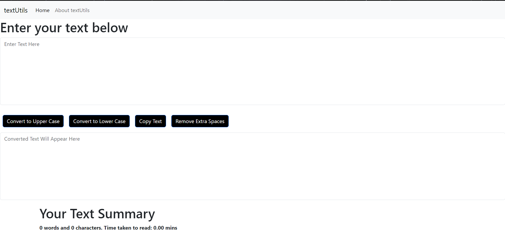
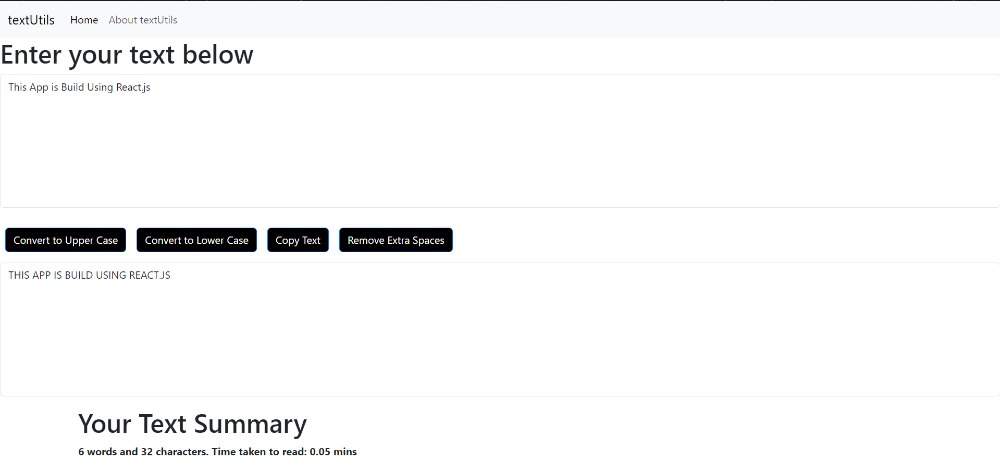
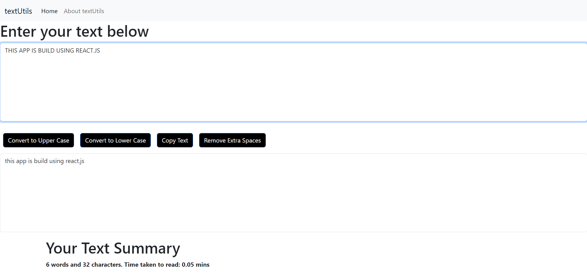

# TextUtils Project

**Author:** Shubham Singh
[LinkedIn](https://www.linkedin.com/in/shubhamsingh3804?lipi=urn%3Ali%3Apage%3Ad_flagship3_profile_view_base_contact_details%3Bbjvf0RrmRsybYMeKzMPi5w%3D%3D)

## Website Name: textUtils

### Purpose
The website allows users to perform various text manipulations such as converting text to uppercase, lowercase, copying the text, removing extra spaces, and resetting the input field.

### UI Design
The interface is clean and minimalistic, making it easy to use. It has a clear header, text input area, and several buttons for text manipulation.

### Key Features

#### Text Conversion Options
- **Convert to Upper Case:** Converts all input text to uppercase.
- **Convert to Lower Case:** Changes all input text to lowercase.

#### Text Management
- **Copy Text:** Provides an easy way to copy the manipulated text to the clipboard.
- **Remove Extra Spaces:** Automatically removes any unnecessary extra spaces between words in the text.

#### Text Summary
Below the text input area, the website displays a summary of the entered text, showing the number of words, characters, and estimated reading time.

### Layout and Components

- **Header:** Features navigation links such as "Home" and "About Text."
- **Main Section:** Contains a prominent instruction: "Enter your text below," followed by a large text input box.
- **Text Manipulation Buttons:** Below the input box are multiple buttons to convert text, copy, remove spaces, or reset.
- **Text Output Area:** A section labeled "Converted Text Will Appear Here" is where users can view the manipulated text.
- **Text Summary Section:** Displays statistics about the input text, helping users to gauge the content's length and readability.

### Technologies

- **React.js:** This interactive, dynamic text utility website is built using React, offering fast rendering and a smooth user experience. The buttons and text manipulation options are handled by React's state management, enabling real-time updates.
- **React Router:** Uses `react-router-dom` for fast & efficient loading of components.
- **CSS:** The website uses basic CSS styling from Bootstrap, with a focus on simplicity and clarity.
 
 **-------------------------------------**

# Getting Started with Create React App

This project was bootstrapped with [Create React App](https://github.com/facebook/create-react-app).

## Available Scripts

In the project directory, you can run:

### `npm start`

Runs the app in the development mode.\
Open [http://localhost:3000](http://localhost:3000) to view it in your browser.

The page will reload when you make changes.\
You may also see any lint errors in the console.

### `npm test`

Launches the test runner in the interactive watch mode.\
See the section about [running tests](https://facebook.github.io/create-react-app/docs/running-tests) for more information.

### `npm run build`

Builds the app for production to the `build` folder.\
It correctly bundles React in production mode and optimizes the build for the best performance.

The build is minified and the filenames include the hashes.\
Your app is ready to be deployed!

See the section about [deployment](https://facebook.github.io/create-react-app/docs/deployment) for more information.

### `npm run eject`

**Note: this is a one-way operation. Once you `eject`, you can't go back!**

If you aren't satisfied with the build tool and configuration choices, you can `eject` at any time. This command will remove the single build dependency from your project.

Instead, it will copy all the configuration files and the transitive dependencies (webpack, Babel, ESLint, etc) right into your project so you have full control over them. All of the commands except `eject` will still work, but they will point to the copied scripts so you can tweak them. At this point you're on your own.

You don't have to ever use `eject`. The curated feature set is suitable for small and middle deployments, and you shouldn't feel obligated to use this feature. However we understand that this tool wouldn't be useful if you couldn't customize it when you are ready for it.

## Learn More

You can learn more in the [Create React App documentation](https://facebook.github.io/create-react-app/docs/getting-started).

To learn React, check out the [React documentation](https://reactjs.org/).

### Code Splitting

This section has moved here: [https://facebook.github.io/create-react-app/docs/code-splitting](https://facebook.github.io/create-react-app/docs/code-splitting)

### Analyzing the Bundle Size

This section has moved here: [https://facebook.github.io/create-react-app/docs/analyzing-the-bundle-size](https://facebook.github.io/create-react-app/docs/analyzing-the-bundle-size)

### Making a Progressive Web App

This section has moved here: [https://facebook.github.io/create-react-app/docs/making-a-progressive-web-app](https://facebook.github.io/create-react-app/docs/making-a-progressive-web-app)

### Advanced Configuration

This section has moved here: [https://facebook.github.io/create-react-app/docs/advanced-configuration](https://facebook.github.io/create-react-app/docs/advanced-configuration)

### Deployment

This section has moved here: [https://facebook.github.io/create-react-app/docs/deployment](https://facebook.github.io/create-react-app/docs/deployment)

### `npm run build` fails to minify

This section has moved here: [https://facebook.github.io/create-react-app/docs/troubleshooting#npm-run-build-fails-to-minify](https://facebook.github.io/create-react-app/docs/troubleshooting#npm-run-build-fails-to-minify)
